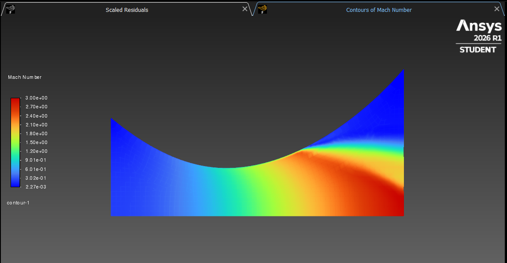
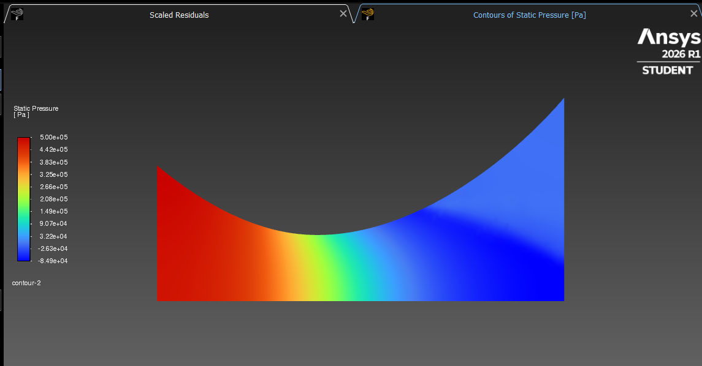
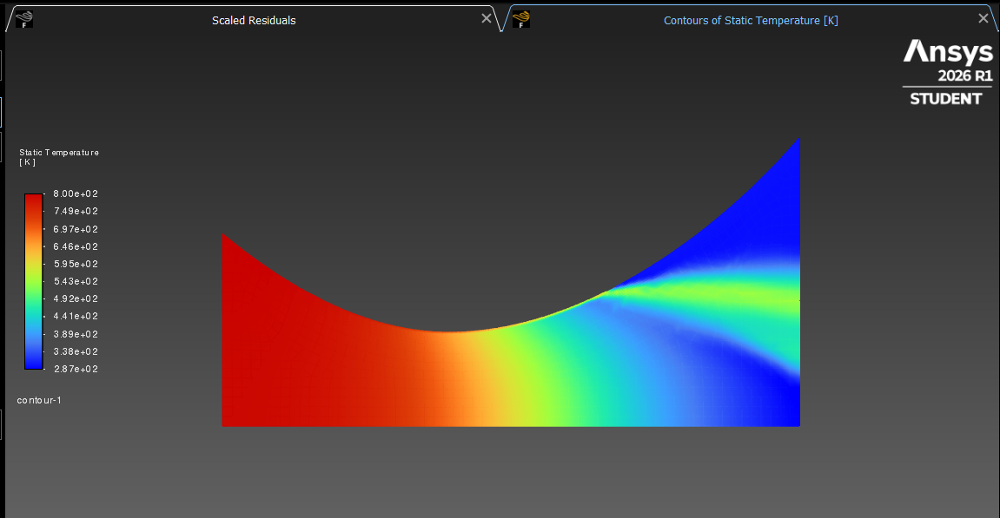
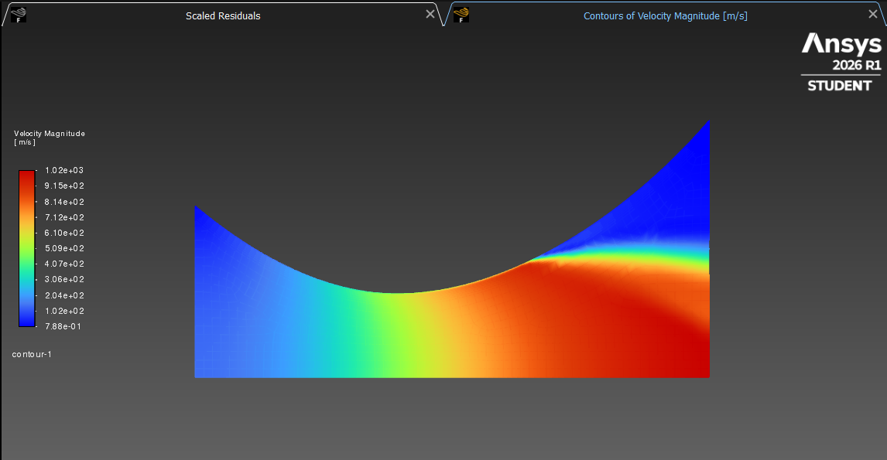

# De Laval Converging-Diverging Rocket Nozzle — CFD Analysis using ANSYS Fluent

   

## Project Overview

This project presents a 2D axisymmetric Computational Fluid Dynamics (CFD) analysis of a De Laval converging-diverging rocket nozzle using ANSYS Fluent 2026 R1. The simulation models compressible, high-temperature gas flow through the nozzle — capturing the full subsonic to supersonic transition at the throat.

This type of nozzle is fundamental to all rocket propulsion systems, including the engines used on Falcon 9, ISRO PSLV, and modern new-space vehicles. The simulation demonstrates key propulsion concepts including isentropic expansion, choked flow at the throat, and supersonic acceleration in the diverging section.

---

## Simulation Parameters

| Parameter | Value |
|---|---|
| Nozzle Type | De Laval Converging-Diverging |
| Inlet Radius | 0.05 m |
| Throat Radius | 0.025 m |
| Outlet Radius | 0.075 m |
| Nozzle Length | 0.3 m |
| Expansion Ratio | 3.0 |
| Inlet Total Pressure | 500,000 Pa (5 bar) |
| Inlet Total Temperature | 800 K |
| Back Pressure | 101,325 Pa (atmospheric) |
| Working Fluid | Air (Ideal Gas) |
| Flow Type | Compressible, Steady, Axisymmetric |
| Solver | Density-Based |
| Turbulence Model | K-omega SST |

---

## Geometry and Mesh

The nozzle geometry was created in ANSYS DesignModeler as a 2D axisymmetric half-profile. A smooth spline curve defines the converging and diverging wall contours, with straight edges for the inlet, outlet, and symmetry axis.

| Boundary | Type |
|---|---|
| Inlet | Pressure Inlet — 500,000 Pa, 800 K |
| Outlet | Pressure Outlet — 0 Pa gauge |
| Wall | No-slip wall |
| Axis | Axisymmetric axis |

Inflation layers were applied at the nozzle wall to resolve the boundary layer accurately. The mesh was generated using ANSYS Meshing with CFD physics preference and Fluent solver settings.

---

## Results

### Mach Number Contour


The Mach number contour clearly shows the three flow regimes inside the nozzle:
- Subsonic flow (Mach ~0.3) at the inlet — shown in blue
- Sonic condition (Mach ~1.0) at the throat — shown in green
- Supersonic flow (Mach ~3.0) at the outlet — shown in red

This is the defining characteristic of a De Laval nozzle and confirms the simulation is physically correct.

---

### Static Pressure Contour


Pressure drops continuously from 500,000 Pa at the inlet to near-atmospheric at the outlet as the flow accelerates through the nozzle. The smooth pressure gradient confirms stable isentropic expansion through the converging-diverging geometry.

**Pressure Range: -84,900 Pa to 500,000 Pa**

---

### Static Temperature Contour


Temperature drops from 800 K at the inlet to approximately 287 K at the outlet. This temperature reduction represents the conversion of thermal energy into kinetic energy — the fundamental thermodynamic process that generates thrust in rocket engines.

**Temperature Range: 287 K to 800 K**

---

### Velocity Magnitude Contour


Flow accelerates from approximately 100 m/s at the inlet to over 1,020 m/s at the nozzle exit — well into the supersonic regime. The velocity increase is most dramatic in the diverging section downstream of the throat.

**Exit Velocity: ~1,020 m/s**

---

## Key Results Summary

| Parameter | Inlet | Throat | Outlet |
|---|---|---|---|
| Mach Number | ~0.30 | ~1.00 | ~3.00 |
| Static Pressure | 500,000 Pa | ~265,000 Pa | ~0 Pa |
| Static Temperature | 800 K | ~667 K | ~287 K |
| Velocity | ~100 m/s | ~520 m/s | ~1,020 m/s |

---

## Validation

The simulation results are consistent with isentropic flow theory for a nozzle with expansion ratio of 3.0:

- Throat Mach number = 1.0 ✅ (choked flow condition achieved)
- Supersonic exit flow confirmed ✅
- Temperature and pressure trends match isentropic relations ✅
- Solution converged in 283 iterations ✅

Reversed flow was observed at the outlet boundary, consistent with over-expanded nozzle behaviour at atmospheric back pressure — a known and documented CFD phenomenon for high expansion ratio nozzles.

---

## Workflow

```
1. Nozzle geometry built in ANSYS DesignModeler — 2D axisymmetric half profile
2. Smooth spline curve generated from analytically defined coordinates
3. Named selections assigned — inlet, outlet, wall, axis
4. Mesh generated in ANSYS Meshing with boundary layer inflation
5. Density-based compressible solver configured in ANSYS Fluent
6. Ideal gas model with energy equation enabled
7. K-omega SST turbulence model applied
8. Solution converged in 283 iterations
9. Post-processing — Mach, pressure, temperature, velocity contours extracted
```

---

## Tools Used

| Tool | Purpose |
|---|---|
| ANSYS DesignModeler | Nozzle geometry preparation |
| ANSYS Meshing | Mesh generation with inflation layers |
| ANSYS Fluent 2026 R1 | Compressible CFD solver and post-processing |
| Python | Coordinate generation for nozzle profile |

---

## Physics Concepts Demonstrated

- Isentropic compressible flow through converging-diverging nozzle
- Choked flow condition at nozzle throat (Mach = 1)
- Supersonic acceleration in diverging section
- Thermodynamic energy conversion — thermal to kinetic
- Boundary layer development along nozzle wall
- Over-expanded nozzle behaviour at atmospheric back pressure

---

## Related Projects

- [NACA 0012 Airfoil CFD Analysis](https://github.com/Clasher152003/naca0012-cfd-ansys-fluent) — External aerodynamics simulation

---

## Author

**Ravindra Singh**
Aerospace Engineering Graduate (2025)
Simulation Engineer | CFD & Propulsion | ANSYS Fluent | MATLAB
📧 shekhawatravinder152003@gmail.com
📍 Delhi NCR, India

---

## References

- Anderson, J.D. — Modern Compressible Flow, McGraw-Hill
- ANSYS Fluent Theory Guide 2026 R1
- NASA Technical Report — Isentropic Flow Relations
